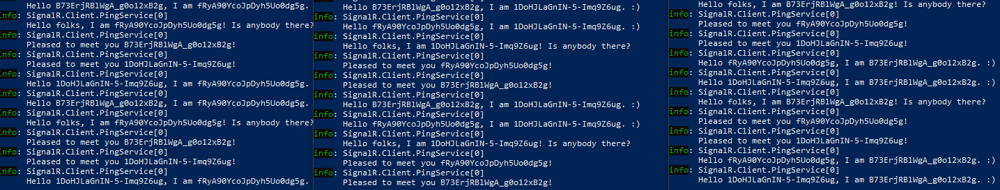

# SignalR
Scratch SignalR demo app, containing two solutions - one Server webapp and one Client console app which runs a background service.

The purpose of the app is for clients to "ping" the server to ask which other clients are connected, and to reply to pings from other clients with a "pong" response.

## Server

Acts as a relay between clients. Sets up a single SignalR Hub `PingHub` with two methods `Ping` and `Pong`
- `Ping` takes a single string argument `pinger` and forwards it on to all other clients (i.e. all clients except the one calling the method). It does this by calling the method `Pinged` on each client, passing on the `pinger` argument as payload.
- `Pong` takes two string arguments `pinger` and `ponger`. It relays the call back to the specific client with connectionId `pinger`, calling the method `Ponged` for that client and passing the `ponger` argument as payload.

## Client
Runs a background service PingService
- After initial setup, it runs a loop which calls `Ping` on the server every ten seconds, passing its SingalR connectonId as the `pinger` payload, and logs this activity to the console.
- On recieveing a `Pinged` message from the server, it responds by calling `Pong`on the server, passing details of the original pinger and its SingalR connectonId as the `ponger`, and logs this activity to the console.
- On recieving a `Ponged` message from the server, it logs this activity to the console.

An example of the logged output from three connected clients is shown below:

